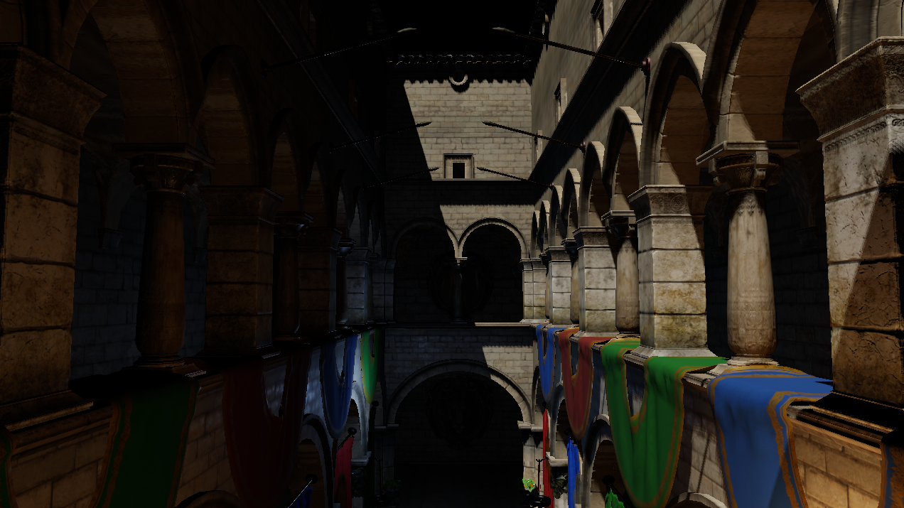

# Vulkan Renderer

A real-time **deferred physically-based renderer** written from scratch in **C++20** on **Vulkan 1.4**. It loads glTF scenes (Sponza) and renders them with Cook-Torrance PBR, directional + point lights in physical units, directional shadow mapping, diffuse image-based lighting from HDR environments, and an HDR pipeline with physically-driven exposure and ACES tonemapping.

No engine, no Vulkan wrapper libraries: the graphics abstractions, memory handling, and render pipeline are all hand-written. The only helper library is [VMA](https://github.com/GPUOpen-LibrariesAndSDKs/VulkanMemoryAllocator).



## Features

- **Deferred pipeline with a depth prepass** — geometry is rasterized once into a G-buffer; each visible pixel is shaded exactly once (`EQUAL` depth test).
- **Cook-Torrance PBR** — metallic-roughness workflow with the full glTF texture set (base colour, metallic-roughness, normal, emissive, occlusion).
- **Physical lights** — directional light in lux, point lights in candela, with inverse-square falloff.
- **Directional shadow mapping** — orthographic frustum fit to the scene AABB, 3×3 PCF soft edges.
- **Diffuse image-based lighting** — HDR equirectangular environment → cubemap → irradiance map, precomputed once at load.
- **HDR + exposure** — the whole pipeline is `RGBA16F`; a physical camera model (aperture / shutter / ISO → EV100) drives exposure, then ACES tonemaps to the sRGB swapchain.
- **Free-fly interactive camera** with frame-independent movement.

## Tech stack

`C++20` · `Vulkan 1.4` · `VMA` · `GLFW` · `GLM` · `tinygltf` · `stb_image` · `CMake` · `glslc`

## Building

**Prerequisites:** the [Vulkan SDK](https://vulkan.lunarg.com/) (1.4+, provides `glslc`), CMake 3.20+, and a C++20 compiler. Currently targets **Windows 64-bit**.

Third-party libraries (GLFW, GLM, VMA, tinygltf, stb) are pulled in via CMake.

```bash
git clone --recursive https://github.com/butterdawgg/Vulkan-Renderer.git
cd <repo>
cmake -B build -DCMAKE_BUILD_TYPE=Release
cmake --build build --config Release
```

GLSL shaders are compiled to SPIR-V by the build. At runtime the executable expects the compiled `shaders/` next to it, plus the Sponza glTF scene and (optionally) an `.hdr` environment map — adjust the paths in `app.cpp` to point at your assets.

## Controls

| Input | Action |
|---|---|
| `W` `A` `S` `D` | Move |
| `Q` / `E` | Down / up |
| Right mouse + drag | Look around |
| `Shift` | Move faster |

## Project structure

```
vulkan_context      instance, device, queues, VMA allocator
resource_manager    all buffer/image allocation (single VMA owner)
command_context     command pool + per-frame buffers + immediate submit
swapchain           swapchain images & views
frame_sync          semaphores + fences
render_targets      offscreen render passes, G-buffer, framebuffers
pipeline_builder    fluent VkPipeline construction
ibl                 HDR environment -> irradiance precompute
renderer            top-level orchestration + the 5-pass frame (pImpl)
scene / mesh / material / camera / transform / lighting   scene data model
gltf_loader         glTF import (tinygltf)
shaders/            GLSL for all five passes + IBL precompute
```

## Known limitations

Single shadow cascade, diffuse-only IBL (no specular reflections), no transparency, and no frustum culling.
